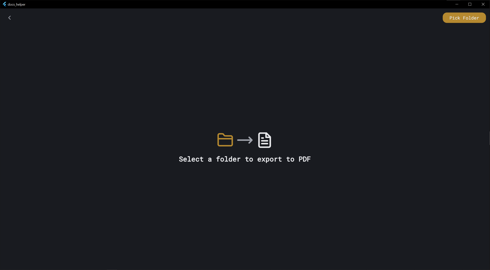
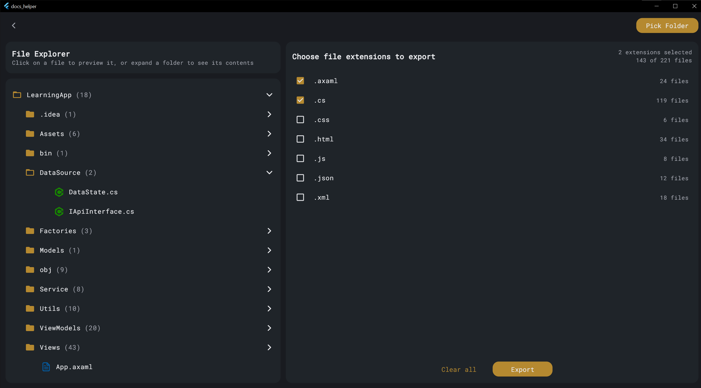
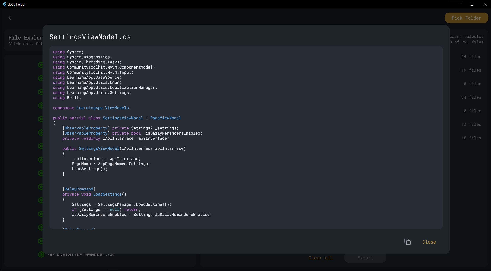
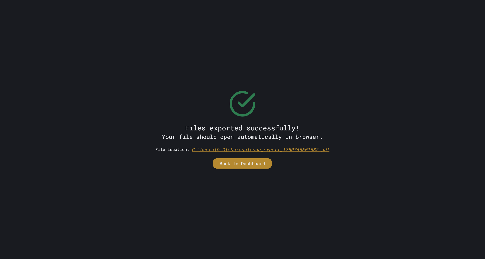
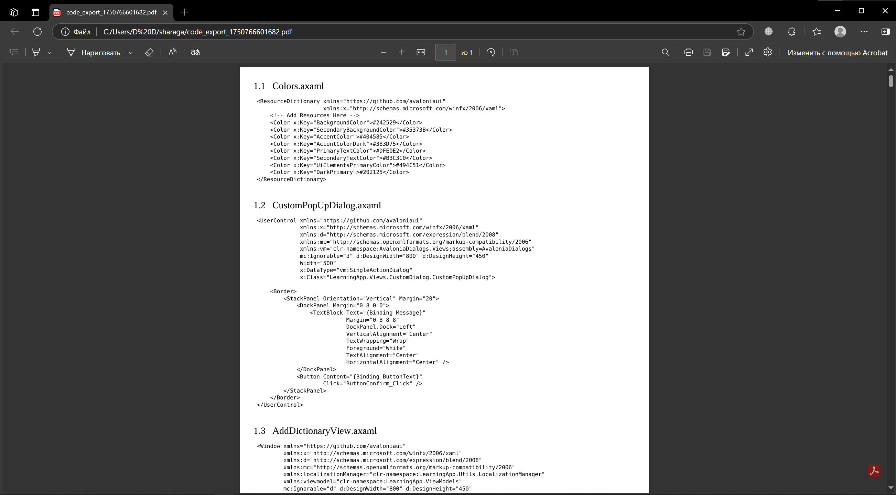

# Docs helper
A Flutter-based tool for generating PDF documentation from project's source code.
## Features
 - Folder Selection: Choose a project directory to scan for source files

 - File Filtering: Select specific file extensions to include in the documentation

 - Code Export: Generate a clean, formatted PDF containing your project's source code

 - Real-Time Preview: View selected files and extensions before exporting

 - BLoC State Management: Efficient and scalable architecture using Flutter BLoC

## Technologies Used
 - Flutter (Windows support)

 - BLoC for state management

 - pdf package for creating PDFs

 - file_picker for directory selection

 - GetIt for dependency injection

## App screenshots

---

---

---

---

---
more features to come...